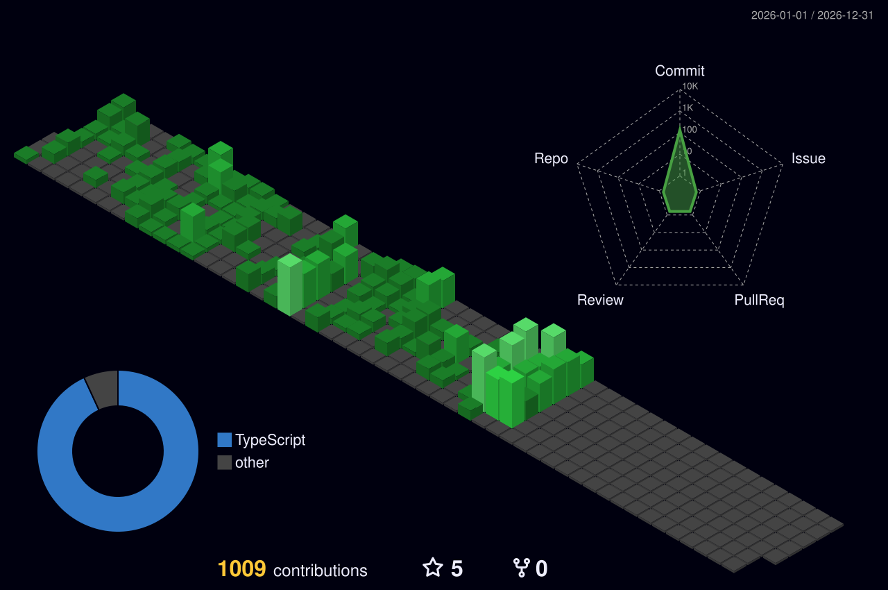

# 🚀 Olá, eu sou o httpE2Barao! 

### 💻 Desenvolvedor Full Stack & Engenheiro de Inteligência Artificial 🤖

---

### 🌐 Conecte-se comigo

 

## 👨‍💻 Sobre Mim & Foco Técnico

- 🤖 Especializado na construção de **Agentes de IA Autônomos, Integração de LLMs e Engenharia de Prompt**.
- 🚀 Desenvolvimento de arquiteturas **Full Stack robustas** utilizando **TypeScript, Next.js, Node.js e Python**.
- 💡 Criador de plataformas de alto nível como o **Platera** e ecossistema **E2Barao**.
- 🎯 Foco em escalabilidade, código limpo, automação de processos complexos e UI/UX de alto padrão.

 

---

## 🛠️ Tecnologias & Stack Principal

  <h3>🧠 Inteligência Artificial, Agentes & Backend</h3>
  

    
  
  <h3>🎨 Frontend Moderno & UI/UX</h3>
  

    

  <h3>🔧 Dev, Automação & Cloud</h3>
  

 

---

## 🚀 Projetos em Destaque

| Projeto | Descrição | Stack Principal | Link / Status |
| :--- | :--- | :--- | :---: |
| **🤖 Platera** | Plataforma Web & IA para automação de processos inteligentes e gestão avançada | `Next.js 14` `TypeScript` `Python` `IA` `Tailwind` | [Acessar Site 🔗](#) |
| **🧠 AI Agent** | Sistema autônomo de agentes inteligentes baseados em LLMs e chamadas de ferramentas | `Python` `TypeScript` `LangChain` `APIs de IA` | `🔒 Sistema Privado / Enterprise` |
| **🌐 E2Barao** | Plataforma oficial de portfólio profissional e vitrine de engenharia web | `Next.js` `TypeScript` `React` `Tailwind` | [Acessar Site 🔗](https://E2-Barao.vercel.app) |
| **📊 Gerador de Relatórios** | Aplicação inteligente para compilação e automação de relatórios | `TypeScript` `React` `Node.js` `Tailwind` | [Acessar Site 🔗](https://gerador-relatorio-divulgacao.vercel.app) |

 

---

## 📊 Gráfico de Contribuições 3D (2026)

  

 

---

## 📈 Atividade no GitHub & Sequência

  

 

  

 

---

  <i>Desenvolvido por httpE2Barao • Atualizado via GitHub Actions 🤖</i>

